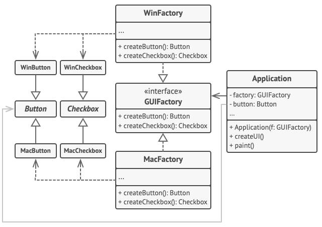

# Abstract Factory

## Intent

concrete class를 직접 정하지 않고도 연관된 객체들의 family를 만들 수 있도록 해주는 design pattern. 
- Refactoring Guru

Abstract Factory는 인터페이스를 이용하여 서로 연관된, 또는 의존하는 객체를 concrete class를 지정하지 않고도 생성할 수 있다.
- Head First Design Pattern

Abstract Factory를 통해 객체들의 Family를 생성하기 위한 interface를 제공할 수 있다. 이 interface를 활용하는 코드를 만들면 제품을 생산하는 실제 팩토리와 분리시킬 수 있다. 그러면 서로 다른 상황별로 적당한 제품을 생산할 수 있는 다양한 팩토리를 구현할 수 있게 된다.

## Problem

여러가지 variant를 제공하는 객체들의 family(group)을 만들어야 하는 상황을 가정해보자. 

이 떄 우리(개발자)는

- 각 family에 속하는 객체들을 만드는 방법을 일일이 정의해줘야 한다.(variant 특성에 맞도록)
- 새로운 객체가 family에 추가되거나, 새로운 variant가 추가된다면 기존 코드까지 모두 수정해야 한다

## Solution

1. 객체 family에 속하는 각각의 객체의 interface를 선언한다
    - 각 객체의 모든 variant가 이 interface를 따르도록 하기 위해
2. Abstract Factory를 선언한다
    - 이 interface는 객체 family에 속한 객체들을 만들어내는 creation 메소드들을 가지고 있다
    - 각 creation 메소드들은 abstract product type을 리턴한다
    - 
3. 각 variant별로 (Concrete) Factory Class를 만든다

추가

client에게 abstract interface만 노출하면 실제 factory객체는 누가/어떻게 만들까

일반적으로 애플리케이션이 초기에 concrete factory 객체를 생성해준다.(애플리케이션이 config, environment setting을 읽고 어떤 factory를 쓸지 결정)

## Structure

## Applicability

클라이언트 코드(애플리케이션)에서 서로 연관된, 의존적인 product의 family를 만들어야 할 때 고민해 볼 만하다.

클라이언트 코드가 family의 각 product class에 의존하고 싶지 않다면 적극 고려.

## Pros and Cons

### Pros

- factory로 부터 생산된 product의 구현을 신경쓰지 않아도 됨(interface를 따르도록 생산했기 때문에)
- concrete product와 client code사이에 느슨한 결합을 유지할 수 있음
- SRP. Product를 생산하는 코드를 분리할 수 있다.
- OCP. 기존 client code를 수정하지 않고 새로운 varaint의 product를 도입할 수 있다.

### Cons

- 여러가지 interface, class 도입으로 코드베이스가 복잡해질 수 있다(복잡하지 않은 디자인 패턴도 있나?)

## 더 공부할 자료

[TypeScript Factory Patterns (No BS TS Series 2 Episode 1)](https://www.youtube.com/watch?v=-1YhP5IOBCI)

## Reference

[Refactoring Guru::Abstract Factory](https://refactoring.guru/design-patterns/abstract-factory)